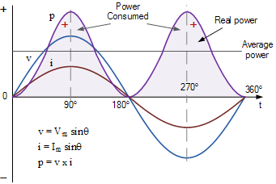

# Power Monitoring Technical
**P = IV**

Ideally measure while maintaining electrical isolation*
We want information _not_ power (seems like a line from a movie?)

Map/convert AC Mains power to 5V DC Voltage

Isolation Methods includes:
- Magnetic (e.g. a transformer) -> big and expensive (10 cm³, $80 AUD) most common
- Optical (e.g. an opto isolator or opto amplifier) (tiny chip, cheap, voltage only)
- Hall effect (e.g. the ACS712 chip) -> cheap, small current can be inferred
- Capacitive a big ol' capacitor/filter(e.g. power device classification [see paper ElectriSense] least safe -> must have capacitive )

## Current I
[Hall effect sensor](http://www.electronicdesign.com/automotive/columbus-2020-and-rise-smaller-smart-cities)
AC712->obsolete, use ACS723 family [A1324](http://pdf1.alldatasheet.com/datasheet-pdf/view/446684/ALLEGRO/A1324.html)
[watch this](https://www.youtube.com/watch?v=UF5jrnXvTlM)
## Voltage V
[Optical isolation amplifier](https://electronics.stackexchange.com/questions/51116/measuring-voltage-while-maintaining-isolation)

## Power Factor cos(Θ)
Is this necessary?
will V and I only show apparent power not real power.

or will the value be average power

Is active power valuable?

what is the impedance profile (purely resistive)

